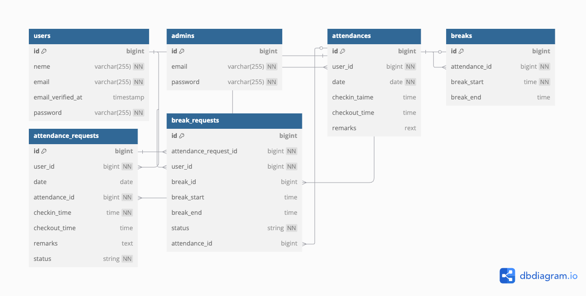

# coachtech勤怠管理アプリ

## プロジェクト内容
coachtech勤怠管理アプリは、
一般ユーザーは勤怠の登録、勤怠修正申請、確認ができ、管理者は一般ユーザーの勤怠確認、勤怠修正、勤怠修正申請の承認ができる勤怠管理のアプリです。
ユーザー登録機能、メール認証機能、ログイン機能、勤怠登録機能、勤怠修正・修正申請・修正申請承認機能、CSV出力機能などを実装しています。

## 機能一覧
一般ユーザー
- ユーザー登録・ログイン機能（メール認証あり）
- 勤怠の登録（出勤・退勤・休憩）
- 自身の勤怠確認
- 勤怠の修正申請
管理者
- ログイン機能
- 全ユーザーの勤怠確認
- 勤怠の修正
- 勤怠修正申請の承認
- 各ユーザーの月次勤怠CSV出力

## 環境構築
### Dockerビルド
1. git clone git@github.com:nami49s/coachtech_attendance.git
2. cd coachtech_attendance
3. docker-compose up -d --build
* MySQLは、OSによって起動しない場合があるのでそれぞれのPCに合わせてdocker-compose.ymlファイルを編集してください。

### Laravel環境構築
1. srcディレクトリ内で .env.example をコピーして .env を作成
2. cd src
3. docker-compose exec php bash
4. composer install
5. php artisan key:generate
6. php artisan migrate
7. php artisan db:seed
8. php artisan serve

## 使用技術
* PHP 8.4.3
* Laravel 12.4.0
* MySQL 9.1.0

## 使用ライブラリ

### バックエンド
- **Laravel Framework**: ^12.0
  PHPフレームワーク。本プロジェクトの中核。
- **PHP**: ^8.2
  Laravel動作に必要なバージョン。
- **Laravel Fortify**: ^1.25
  認証機能を提供するライブラリ（ログイン・登録）。
- **Laravel Vite Plugin**: ^1.2
  Viteとの統合用プラグイン。

### フロントエンド
- **Vite**: ^6.0.11
  フロントエンドアセットのビルドツール。
- **Tailwind CSS**: ^4.0.0
  ユーティリティファーストなCSSフレームワーク。
- **Axios**: ^1.8.2
  非同期通信（API連携）用のHTTPクライアント。

### ローカル開発用
- **Laravel Pint**: ^1.13
  コード整形ツール。
- **FakerPHP/Faker**: ^1.23
  テストデータ生成ライブラリ。
- **PHPUnit**: ^11.5.3
  単体テストフレームワーク。

### ログ・監視・その他
- **Laravel Pail**: ^1.2.2
  アプリケーションログのリアルタイム監視。
- **Laravel Lang**: ~7.0
  多言語化サポート。日本語対応に使用。
- **Mailtrap**
  開発環境でのメール送信確認用サービス。
  `.env` に以下の設定を記述することで使用可能：
```dotenv
MAIL_MAILER=smtp
MAIL_HOST=sandbox.smtp.mailtrap.io
MAIL_PORT=2525
MAIL_USERNAME=your_mailtrap_username
MAIL_PASSWORD=your_mailtrap_password
MAIL_ENCRYPTION=tls
MAIL_FROM_ADDRESS=test@example.com
MAIL_FROM_NAME="coachtech_attendance"
```

*Mailtrap の設定後、以下のコマンドでメール送信をテストできます。 php artisan tinker Mail::raw('テストメール', function($message) { $message->to('test@example.com')->subject('Test Email'); });


## URL
* 開発環境:http://localhost
* phpMyAdmin:http://localhost:8080

## ER図　　


## テストユーザー情報
一般ユーザー: シーディングで作成されるテストユーザーのメールアドレスは、毎回異なります。これは、test と現在時刻 (time()) を組み合わせて一意のメールアドレスを生成しているためです。
* メール: test{timestamp}@example.com（例: test1609459200@example.com）
* パスワード: password
このテストユーザーは、UsersTableSeeder によって作成されます。
管理者
* メール: admin@example.com
* パスワード: password123
この管理者は、AdminsTableSeeder によって作成されます。
